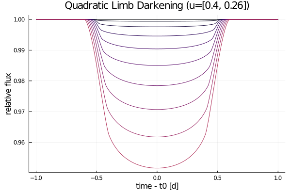
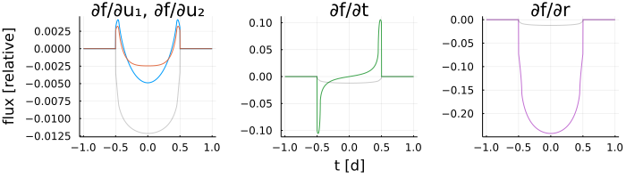

# Getting Started

## Usage

```julia
using Orbits
using Transits

orbit = SimpleOrbit(period=3, duration=1)
u = [0.4, 0.26] # quad limb dark
ld = PolynomialLimbDark(u)

t = range(-1, 1, length=1000) # days from t0
rs = range(0, 0.2, length=10) # radius ratio

fluxes = @. ld(orbit, t, rs')
```



## Integrated and Secondary Curves

[`IntegratedLimbDark`](@ref) can be used to numerically integrate each light curve exposure in time

```julia
ld = IntegratedLimbDark([0.4, 0.26])
orbit = SimpleOrbit(period=3, duration=1)
t = range(-1, 1, length=1000)
texp = [0.1 0.2 0.3]
# no extra calculations made
flux = @. ld(orbit, t, 0.2)
# use quadrature to find time-averaged flux for each t
flux_int = @. ld(orbit, t, 0.2, texp) 
```


[`SecondaryLimbDark`](@ref) can be used to generate secondary eclipses given a surface brightness ratio

```julia
ld = SecondaryLimbDark([0.4, 0.26], brightness_ratio=0.1)
ld_int = IntegratedLimbDark(ld) # composition works flawlessly

orbit = SimpleOrbit(period=4, duration=1)
t = range(-1.25, 2.75, length=1000)
rs = range(0.01, 0.1, length=6)

f = @. ld(orbit, t, rs')
f_int = @. ld_int(orbit, t, rs', texp=0.3)
```


## Using Units

Units from `Unitful.jl` are a drop-in substitution for numbers

```julia
using Unitful
orbit = SimpleOrbit(period=10u"d", duration=5u"hr")
t = range(-6, 6, length=1000)u"hr"
flux = @. ld(orbit, t, 0.1)
```

## Gradients

Gradients are provided in the form of [chain rules](https://github.com/JuliaDiff/ChinaRules.jl). The easiest way to access them is using an automatic differentiation (AD) library like [ForwardDiff.jl](https://github.com/JuliaDiff/ForwardDiff.jl) or [Zygote.jl](https://github.com/FluxML/Zygote.jl).

```julia
using Zygote

ts = range(-1, 1, length=1000) # days from t0
ror = 0.1
u_n = [0.4, 0.26]

orbit = SimpleOrbit(period=3, duration=1)
lightcurve(X) = compute(PolynomialLimbDark(X[3:end]), orbit, X[1], X[2])

# use Zygote for gradient
flux = [lightcurve([t, ror, u_n...]) for t in ts]
grads = mapreduce(hcat, ts) do t
    grad = lightcurve'([t, ror, u_n...])
    return grad === nothing ? zeros(4) : grad
end
```


